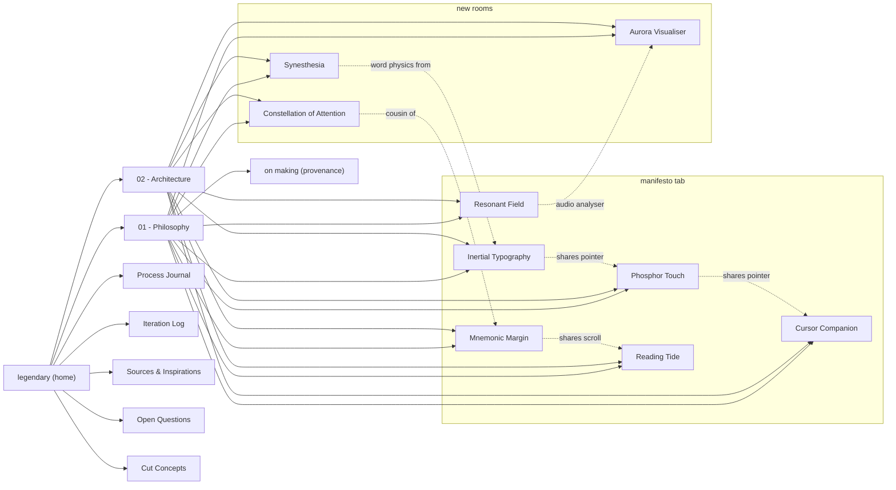

# map



## suggested reading paths

**the impatient critic** — [[01 - Philosophy]] → [[Open Questions]]

**the designer** — [[01 - Philosophy]] → any concept note → [[Cut Concepts]] → [[Sources & Inspirations]]

**the engineer** — [[02 - Architecture]] → each concept note (the *implementation* and *pitfalls* sections) → [[Process Journal]]

**the curator** — [[Sources & Inspirations]] → [[Cut Concepts]] → [[Iteration Log]]

## file inventory

```
Legendary UI-UX/
├── Legendary UI-UX.md                   ← home
├── 00 - Map.md                          ← you are here
├── 01 - Philosophy.md
├── 02 - Architecture.md
├── Concept - Inertial Typography.md
├── Concept - Phosphor Touch.md
├── Concept - Mnemonic Margin.md
├── Concept - Resonant Field.md
├── Concept - Reading Tide.md
├── Concept - Cursor Companion.md
├── Concept - Aurora Visualiser.md
├── Concept - Synesthesia.md
├── Concept - Constellation of Attention.md
├── Cut Concepts.md
├── Sources & Inspirations.md
├── Process Journal.md
├── Open Questions.md
└── Iteration Log.md
```

## the four rooms and what each demonstrates

```
manifesto                                      resonance
─────────────                                  ─────────────
inertial typography (all tabs)                 aurora visualiser
phosphor touch (all tabs)                      + uses the drone's FFT
mnemonic margin
reading tide
cursor companion (all tabs)
resonant field (all tabs, persistent)
on making (provenance · before coda)

synesthesia                                    constellation
─────────────                                  ─────────────
letter→colour palette                          dwell-to-ignite stars
word inertial physics (pretext-inspired)       line-graph of attention
page tint to averaged word colour              persists with scroll
```
